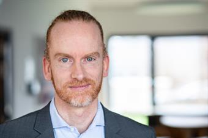

I enjoy combining theory and (computer) science with real world information technology and real world challenges.
I am a father of tow and enthusiastic also about football, triathlon, and sim racing.

## Background
- Education: Computer Science
- Research: Semantic Web and AI
- IT-Consulting: Enterprise Architecture, IT-Strategy, Software Architecture, Software Engineering

## Work
- I am a full professor at the [University of Applied Sciences Düsseldorf - (Hochschule Düsseldorf)](https://www.hs-duesseldorf.de).
- I am also working with industry, commerce and administration in various 
[projects]({{ site.baseurl }}).
